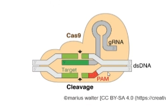

## Markdown fundamentals
- [Markdown fundamentals](#markdown-fundamentals)
  - [Bullet points](#bullet-points)
  - [Numbering](#numbering)
  - [Bold and italics](#bold-and-italics)
  - [Images](#images)
  - [Links](#links)
  - [Creating table of contents](#creating-table-of-contents)

### Bullet points

- Use when sequence is **NOT** important
- Can use either - or  * for the bullet points.

* Point 1
* Point 2
  *  Sub point 1
     *   sub-sub point 1

- Point 1
- Point 2

### Numbering 
1. First instruction
2. Second instruction
   1.  Sub step 1
   2.  Sub step 2
        * Point for sub step 2 
  

### Bold and italics
* CTRL + B  - **bold**
* CTRL + I - *italics*

### Images 

* Embed images using drag + drop + SHIFT
  

### Links

Click [here](https://google.com) to go to google.com. 

### Creating table of contents

* CTRL + SHIFT + P and type create table of contents. 

